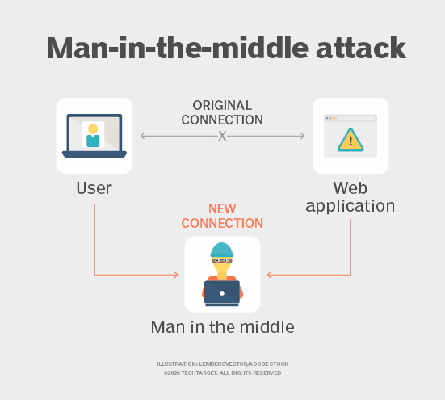
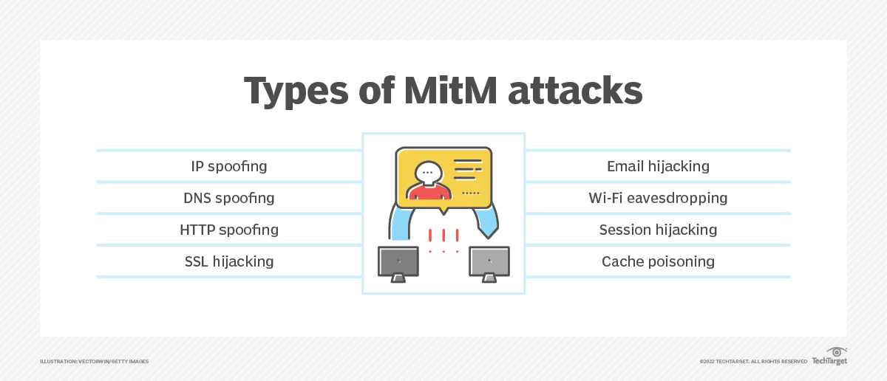
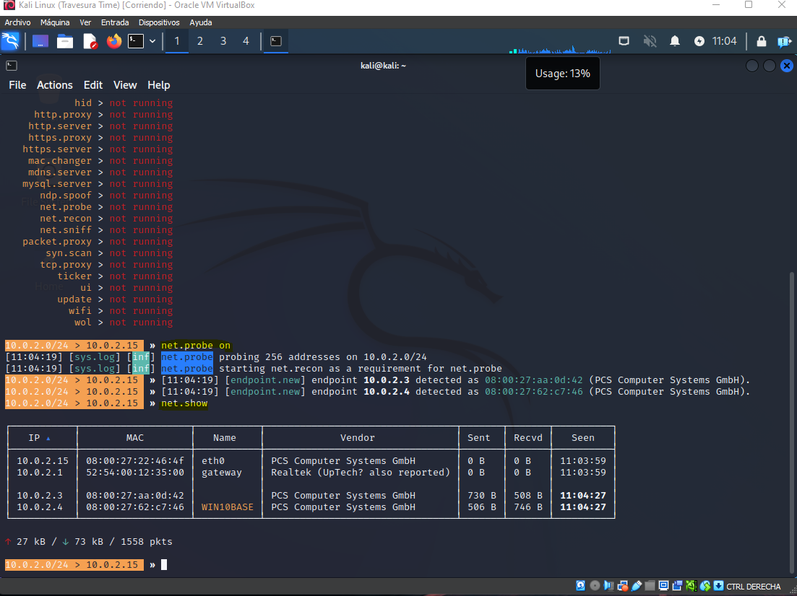
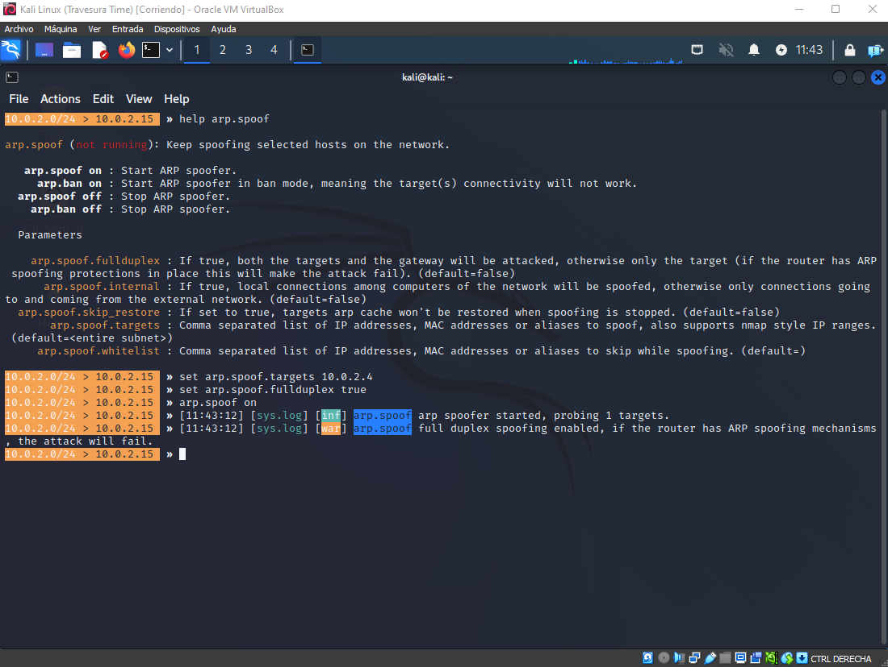
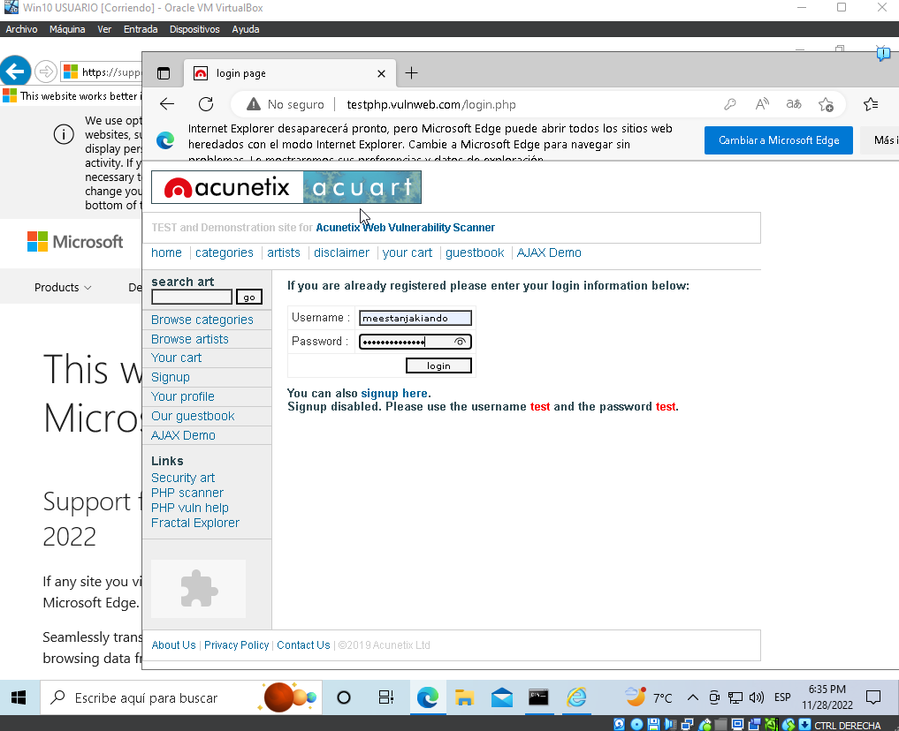
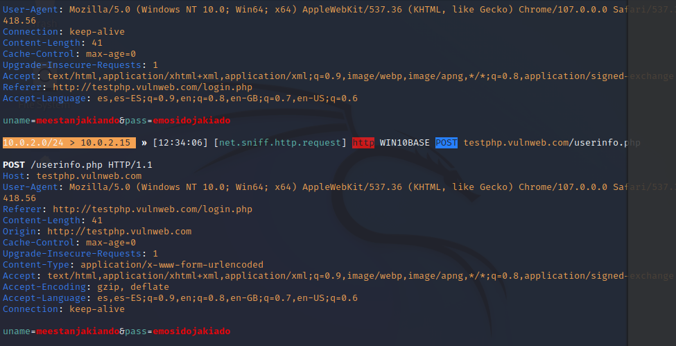

# NETWORK ATTACKS

## MAN IN THE MIDDLE

### DEFINICIÓN

> Es un tipo de ataque que tiene como objetivo interceptar, sin autorización, la comunicación entre dos dispositivos (hosts) conectados a una red. Este ataque permite a un tercero manipular el tráfico interceptado de diferentes formas, ya sea para escuchar la comunicación y obtener información sensible (passwords, información bancaria, credenciales...), o para suplantar la identidad de alguna de las partes. 

> Para que un ataque MitM funcione correctamente, el delincuente debe asegurarse de que va a ser el único punto de comunicación entre los dos dispositivos estando presente en la misma red que los hosts y cambiar la tabla de enrutamiento para cada uno de ellos.



> Su ataque más común se ejecuta a través de un malware que infecta el navegador del usuario robando los datos que envía o recibe y desencriptándolos, conectándose con el sitio real actuando como proxy.

- Existen distintos tipos de ataques MitM:



- **Internet Protocol Spoofing:** Se hacen con la IP del servicio y la suplantan permitiendo recoger los datos de todos los que se conecten al falso dispositivo.

- **Domain Name System Spoofing:** Manipulan un DNS oficial para redireccionar el tráfico hacia sitios falsos.

- **HTTP Spoofing:** El atacante cambia la sesión de una página web con HTTPS a una con HTTP.

- **Secure Sockets Layer hijacking:** Usando un servidor seguro y otro ordenador para interceptar la información.

- **Email hijacking:** Posee los correos oficiales de organismos tanto para informase de los clientes como para actuar en nombre del organismo.

- **Wi-Fi eavesdropping:** Común en redes Wi-Fi públicas, el atacante puede crear una red falsa a la que accederán los usuarios y les robaría la información que transmitan.

- **Session hijacking:** Roban o suplantan las cookies del usuario pudiendo acceder a sesiones como del banco, tiendas y realizar acciones en su nombre.

- **Cache poisoning:** También llamado ARP cache poisoning, permite al atacante monitorear el trafico dentro de la subred en la que se encuentra.

### EJEMPLO

Vamos a ver un ejemplo de Internet Protocol Spoofing:

Usando una máquina con el SO de Kali Linux, descargamos e instalamos un programa llamado `bettercap`.

> - Recuerda hacer un `sudo apt-get update`.
> - Bettercap es un framework que ataca a redes Wi-Fi, dispositivos Blue-Tooth y redes IPv4/IPv6.

Una vez instalado, lo ejecutamos y con el comando `help` nos dará información de los módulos. Usaremos cada módulo según nuestra necesidad.


En este caso vamos a rastrear los equipos que hay conectados a la red.

```php
net.probe on        # Activará el módulo indicado. (Rastrea la red)
net.show            # Mostrará en una tabla todos los dispositivos rastreados.
```



Vemos como ha encontrado mi otra máquina de Windows 10.

Ahora vamos a activar el módulo arp.spoof, este módulo pretende enmascarar la máquina de Kali con otra MAC para que el Win10 se crea que es un destino para llegar al router y salir a internet.

```php
help arp.spoof      # Muestra las opciones y parámetros.
arp.spoof on        # Activa el módulo.
set arp.spoof.target <IP/MAC>   # Añade un objetivo a través de su IP o MAC (funciona con rangos de IP)
set arp.spoof.fullduplex true # La máquina finge no tener internet (es un router)
```



Vemos como ha empezado a suplantar como router al Windows 10.

Ahora necesitamos rastrear lo que manda y recibe de la red.
Para eso activamos el módulo `net.sniff`

```php
net.sniff on        # Rastrea todo lo que pasa por la red.
```


Como muestra la imagen ha empezado a rastrear la conexión que esta haciendo el Windows 10.

Ahora en el Windows 10 vamos a entrar en una página web usando el protocol HTTP e introducir datos de inicio de sesión.



Cuando pulsemos el botón de login, nuestra máquina recibe los datos que se han introducido.



### VULNERABILIDAD Y PROTECCIÓN

Este ataque afecta a toda la red y sistemas, ya que puede consigue los datos de conexión que pasan por la red, incluyendo credenciales de los sistemas.

Para protegerte asegúrate de que las conexiones sean por el protocolo HTTPs, evita abrir correos sospechosos (el banco no te va a pedir tu usuario), usar VPNs y usar programas anti-malware.
